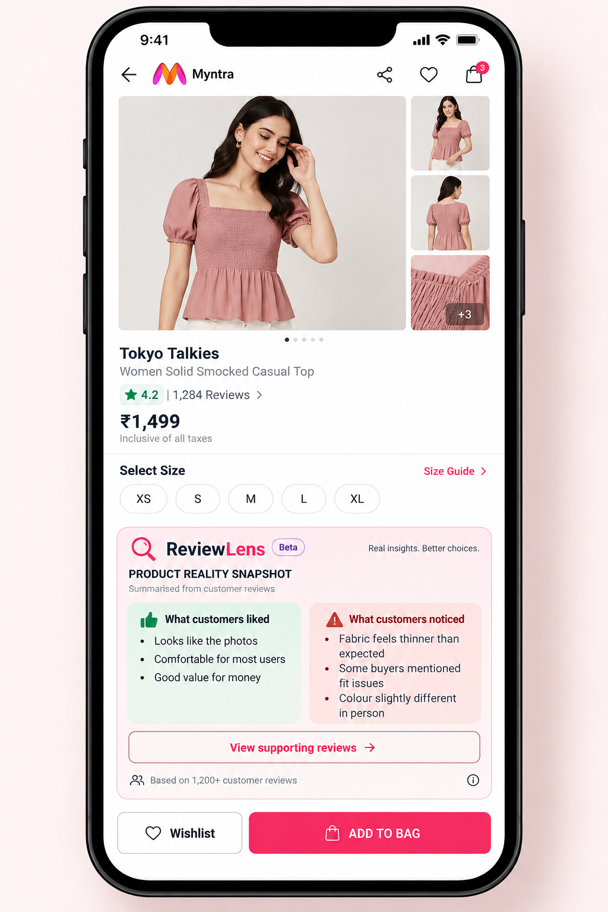

# ReviewLens

### Turn customer reviews into product intelligence.

ReviewLens is a product management case study for Myntra that explores how unstructured customer reviews can be transformed into a concise "Product Reality Snapshot" to help shoppers make more informed purchase decisions.

## Problem

Myntra already provides ratings, reviews, customer photos, product descriptions and other product information.

However, important customer experiences remain scattered across hundreds of reviews, making it difficult for shoppers to quickly understand what the product is actually like after purchase.

## Proposed Solution

ReviewLens introduces a "Product Reality Snapshot" that summarizes recurring customer experiences such as:

- Product quality
- Colour/appearance mismatch
- Fabric expectations
- Fit and length
- Product-photo mismatch
- Other recurring customer concerns

The goal is not to replace reviews, but to make the most useful information from them easier to understand before purchase.

## Prototype

A mockup of the Product Reality Snapshot on a Myntra product page:

## Project Type

Product Management Case Study

## Focus Areas

- Customer Problem Discovery
- Product Analytics
- User Research
- Root Cause Analysis
- Product Design
- MVP Prototyping
- Product Metrics
- Experimentation

## Repository Structure

- `docs/` — problem statement, proposed solution, user flow, MVP scope
- `research/` — user interviews, competitive & gap analysis, supporting market data
- `analysis/` — data and analytics plan
- `prototype/` — product page mockup
